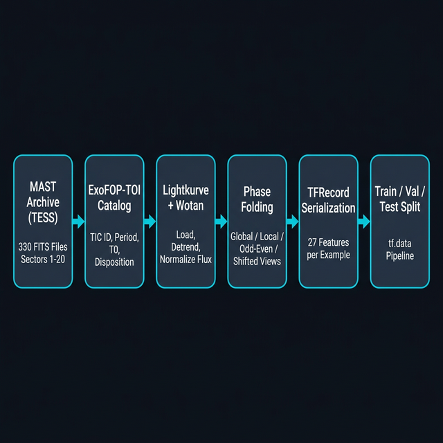
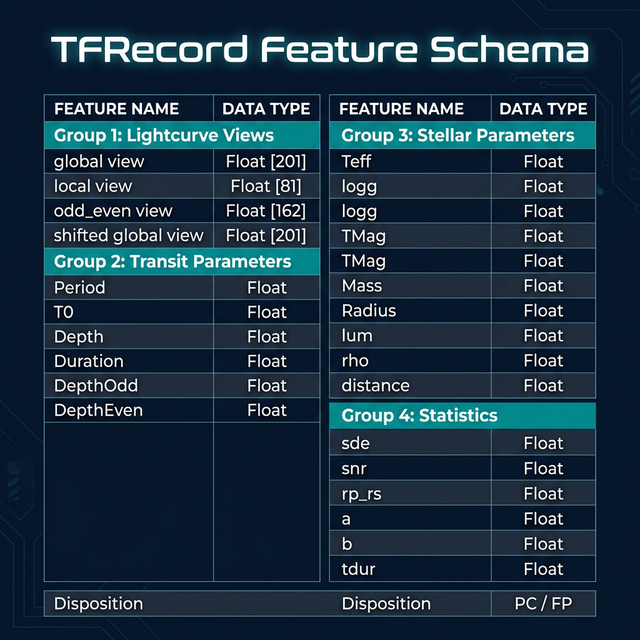
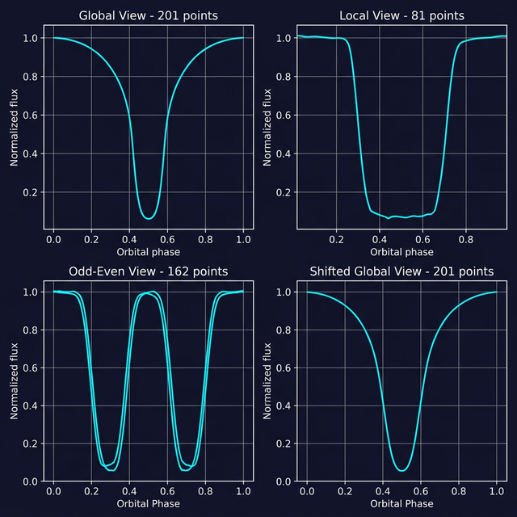
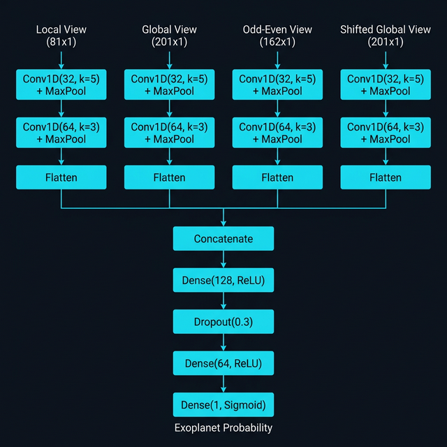

# Exodec — TESS Exoplanet Transit Pre-Processing Pipeline

A machine learning pipeline for detecting exoplanet transit candidates from NASA TESS (Transiting Exoplanet Survey Satellite) photometric lightcurves. Raw FITS observations are downloaded from MAST, processed into phase-folded view representations, serialized as TFRecords, and fed into a multi-input 1D Convolutional Neural Network for binary classification.

---

## Table of Contents

- [Project Overview](#project-overview)
- [Folder Structure](#folder-structure)
- [Data Pipeline](#data-pipeline)
- [Feature Engineering](#feature-engineering)
- [Lightcurve Views](#lightcurve-views)
- [Model Architecture](#model-architecture)
- [Notebooks](#notebooks)
- [Dependencies](#dependencies)
- [Known Issues](#known-issues)

---

## Project Overview

**Objective**: Classify each TESS Object of Interest (TOI) as a genuine Planet Candidate (PC) or a False Positive (FP) based solely on photometric data and associated stellar/transit parameters.

**Data Source**: NASA MAST archive — TESS 2-minute cadence pre-search data conditioning (PDC) lightcurves from Sectors 1 through 20 (2018–2020).

**Catalog**: ExoFOP-TOI (TESS Objects of Interest catalog), providing disposition labels, orbital parameters, and stellar properties for each TIC target.

**Output**: A probability score in `[0, 1]` indicating how likely the signal is a bona fide exoplanet transit.

---

## Folder Structure

```
pre-processing/
├── dataset/
│   ├── csv-file-toi-catalog.csv          # Main TOI catalog with dispositions
│   ├── period_info-toi-exofop.csv        # Orbital period, epoch, depth, duration
│   └── tic2file-toi.csv                  # TIC ID to FITS filename mapping
│
├── lightcurves/
│   ├── all_fits.txt                      # Manifest of all FITS filenames
│   ├── tess_download.ps1                 # PowerShell batch downloader (MAST API)
│   └── all_lcs/                          # 330 raw FITS lightcurve files
│
├── TFRecords/
│   └── train/
│       └── toi-train.tfRecords           # Legacy single-split TFRecord (~724 KB)
│
├── Tfrecords_zip/
│   ├── train/
│   ├── validate/
│   └── test/
│
├── TfRecord_model.ipynb                  # CNN model definition and training
├── Tf_record_Viewer.ipynb                # TFRecord inspection and visualization
└── requirements.txt                      # Python dependencies
```

---

## Data Pipeline

The pipeline transforms raw telescope observations into structured, model-ready tensors through six distinct stages.



### Stage 1 — Data Acquisition

FITS lightcurve files are downloaded from the MAST public API using the PowerShell script `tess_download.ps1`. It reads a manifest `all_fits.txt` containing 330 filenames and issues resumable `curl` requests to `mast.stsci.edu`. Each file is approximately 2 MB.

```powershell
# tess_download.ps1 — core logic
$url = "https://mast.stsci.edu/api/v0.1/Download/file/?uri=mast:TESS/product/$file"
curl.exe -C - -L -o $file $url
```

### Stage 2 — Catalog Cross-Reference

Three CSV files are joined on TIC ID to assemble a complete metadata record per target:

| Catalog File | Fields |
|---|---|
| `csv-file-toi-catalog.csv` | Disposition (PC/FP), stellar parameters |
| `period_info-toi-exofop.csv` | Period, epoch T0, transit depth, duration |
| `tic2file-toi.csv` | Mapping from TIC ID to FITS filename |

### Stage 3 — FITS Loading and Detrending

Each FITS file is read using `lightkurve` (v1.11.1). The PDC-corrected SAP flux column is extracted. Systematics and stellar variability are removed using `wotan` (a Gaussian Process or biweight detrending algorithm), and the flux is normalized to a median of 1.0.

### Stage 4 — Phase Folding and View Construction

Using the known orbital period and reference epoch from the catalog, flux observations are folded into phase space. Four view representations are constructed from this folded signal (see [Lightcurve Views](#lightcurve-views)).

### Stage 5 — TFRecord Serialization

Each star-transit pair is serialized into a `tf.train.Example` proto containing 27 features (4 view arrays plus 23 scalar fields). The serialized records are written to `.tfRecords` files using `tf.io`.

### Stage 6 — Train / Validate / Test Split

The final dataset is split into three directories under `Tfrecords_zip/`, consumed at training time by a `tf.data.TFRecordDataset` pipeline with parallel reading, shuffling, batching, and prefetching.

---

## Feature Engineering

Each TFRecord example encodes the full information needed for both the lightcurve CNN branches and potential auxiliary dense branches.



### Complete Feature List

| Feature | Shape / Type | Description |
|---|---|---|
| `global view` | VarLen float32 (~201) | Full phase-folded lightcurve |
| `local view` | FixedLen float32 (81) | Zoomed transit window |
| `odd_even view` | VarLen float32 (~162) | Interleaved odd and even transits |
| `shifted global view` | FixedLen float32 (201) | Global view phase-shifted by 0.5 |
| `Disposition` | string | Label: `"PC"` or `"FP"` |
| `TIC_ID` | int64 | TESS Input Catalog identifier |
| `Period` | float32 | Orbital period in days |
| `T0` | float32 | Transit reference epoch (TBJD) |
| `Depth` | float32 | Transit depth (ppm) |
| `DepthOdd` | float32 | Depth of odd-numbered transits |
| `DepthEven` | float32 | Depth of even-numbered transits |
| `Duration` | float32 | Transit duration in hours |
| `tdur` | float32 | Transit duration (BLS fit) |
| `TMag` | float32 | TESS magnitude |
| `Teff` | float32 | Stellar effective temperature (K) |
| `logg` | float32 | Stellar surface gravity |
| `Mass` | float32 | Stellar mass (solar units) |
| `Radius` | float32 | Stellar radius (solar units) |
| `lum` | float32 | Stellar luminosity |
| `rho` | float32 | Stellar density |
| `distance` | float32 | Distance to star (parsecs) |
| `a` | float32 | Semi-major axis (AU) |
| `b` | float32 | Impact parameter |
| `rp_rs` | float32 | Planet-to-star radius ratio |
| `sde` | float32 | Signal Detection Efficiency (BLS) |
| `snr` | float32 | Signal-to-Noise Ratio |
| `NumTransits` | float32 | Number of observed transits |
| `flux` | VarLen float32 | Raw detrended flux array |

---

## Lightcurve Views

The four view types represent different engineered encodings of the same underlying photometric signal. Each captures a specific diagnostic property relevant to transit detection and false-positive rejection.



### Global View (201 points)
The complete phase-folded lightcurve centered on the transit. Captures the full out-of-transit baseline for normalization context and secondary eclipse detection. This is the primary representation used for orbital shape classification.

### Local View (81 points)
A high-resolution zoom into the transit region only (+/- ~1 transit duration from mid-transit). Emphasizes the ingress/egress shape (important for distinguishing V-shaped EB transits from flat-bottomed planet transits).

### Odd-Even View (162 points)
Alternating odd and even transit events are phase-folded separately and concatenated. Depth differences between odd and even transits are a canonical indicator of a background eclipsing binary, where secondary eclipses appear as alternating shallower dips.

### Shifted Global View (201 points)
Identical processing to the global view but with phase shifted by 0.5 orbital period, centering on the secondary eclipse location. A real planet transit should show no secondary eclipse; any dip here indicates a false positive.

---

## Model Architecture

A four-branch multi-input 1D Convolutional Neural Network processes each view representation independently before merging for final classification.



### Per-Branch Processing

Each input branch applies the same two-stage convolution pattern:

```
Input (L, 1)
    Conv1D(filters=32, kernel_size=5, activation='relu', padding='same')
    MaxPooling1D(pool_size=2, padding='same')
    Conv1D(filters=64, kernel_size=3, activation='relu', padding='same')
    MaxPooling1D(pool_size=2, padding='same')
    Flatten()
```

The kernel sizes are chosen to match the characteristic scales of transit features: `k=5` captures the broad transit shape and `k=3` refines local gradient features.

### Merged Classification Head

```
Concatenate([local_flat, global_flat, odd_even_flat, shifted_flat])
    Dense(128, activation='relu')
    Dropout(rate=0.3)
    Dense(64, activation='relu')
    Dense(1, activation='sigmoid')   ->  exoplanet_probability in [0, 1]
```

### Training Configuration

| Parameter | Value |
|---|---|
| Loss function | Binary cross-entropy |
| Optimizer | Adam (default lr = 0.001) |
| Batch size | 64 |
| Shuffle buffer | 2000 |
| Epochs | 10 |
| Positive label | `Disposition == "PC"` → 1.0 |

---

## Notebooks

### `TfRecord_model.ipynb`

The primary training notebook. Defines the full `tf.data` ingestion pipeline, model architecture, and training loop.

**Key functions:**

| Function | Purpose |
|---|---|
| `parse_tfrecord_fn(example_proto)` | Deserializes a single TFRecord proto into input tensors and binary label |
| `process_varlen_feature(feature, target_len)` | Pads or truncates variable-length sparse tensors to a fixed length |
| `create_tf_dataset(data_dir, ...)` | Builds a shuffled, batched, prefetched `tf.data` pipeline from a directory of TFRecords |
| `build_cnn_model()` | Constructs and compiles the multi-input CNN using the Keras functional API |
| `count_records(file_paths)` | Counts total examples across a list of TFRecord files for computing `steps_per_epoch` |

**Known Issue**: The `if __name__ == '__main__':` guard on the main execution block causes it to never run inside a Jupyter kernel. This block must be removed or unwrapped for the training loop to execute.

---

### `Tf_record_Viewer.ipynb`

An exploratory inspection notebook for validating TFRecord content. Does not define any model logic.

**Cell 0** — Raw proto print: Loads a single TFRecord and prints the raw `tf.train.Example` proto for manual inspection. Useful for verifying that all expected features were serialized correctly.

**Cell 1** — Parsed record: Defines the full 27-feature schema and parses one record. Prints all scalar values and converts the four sparse view tensors to dense NumPy arrays.

**Cells 2–3** — Visualization: Plots all four lightcurve view arrays using Matplotlib with appropriate axis labels and titles.

**Schema defined in viewer (27 features):**

```python
feature_description = {
    'Depth', 'DepthEven', 'DepthOdd', 'Duration', 'flux',   # VarLen float32
    'global view', 'local view', 'odd_even view',            # VarLen float32
    'shifted global view',                                    # VarLen float32
    'Disposition',                                           # string
    'Mass', 'NumTransits', 'Period', 'Radius', 'T0',         # float32
    'TIC_ID',                                                # int64
    'TMag', 'Teff', 'a', 'b', 'distance', 'logg',          # float32
    'lum', 'rho', 'rp_rs', 'sde', 'snr', 'tdur'            # float32
}
```

---

## Dependencies

Install all dependencies using:

```bash
pip install -r requirements.txt
```

| Package | Version | Role |
|---|---|---|
| `lightkurve` | 1.11.1 | FITS lightcurve loading, detrending, phase-folding |
| `tensorflow` | latest | TFRecord I/O, `tf.data`, model training |
| `numpy` | latest | Numerical array operations |
| `pandas` | latest | CSV catalog loading and cross-referencing |
| `scipy` | latest | Signal processing utilities |
| `wotan` | latest | Flexible detrending (biweight / GP) |
| `astropy` | latest | FITS file I/O and header parsing |
| `tqdm` | latest | Progress bar for batch processing |
| `matplotlib` | latest | Lightcurve and result visualization |

---

## Known Issues

The following issues were identified during code review of the two notebooks:

| Issue | Severity | Location | Description |
|---|---|---|---|
| `__main__` guard in Jupyter | Critical | `TfRecord_model.ipynb`, Cell 0 | `if __name__ == '__main__':` block never executes inside a Jupyter kernel. Training loop is dead code. |
| Hardcoded absolute paths | High | Both notebooks | Paths reference `C:\Users\Naman Rajput\Desktop\Exodec\...` and will break on any other machine. |
| Schema mismatch (27 vs 5 features) | Medium | Model notebook | Viewer parses 27 features; model only uses 4 lightcurve views + label, discarding Period, SNR, SDE, Radius, etc. |
| `local view` type inconsistency | Medium | Both notebooks | Viewer treats it as `VarLen`; model expects `FixedLen([81])`. Mismatches cause silent padding. |
| No model saving | Low | `TfRecord_model.ipynb` | `model.save()` is never called after training. Trained weights are lost on kernel restart. |
| No class-imbalance handling | Low | `TfRecord_model.ipynb` | PC/FP imbalance is common in TOI catalogs (~30% PC). No `class_weight` or oversampling is applied. |
| No early stopping | Low | `TfRecord_model.ipynb` | Fixed 10 epochs with no `EarlyStopping` or `ModelCheckpoint` callbacks. |

---

*Data sourced from the NASA TESS Mission via the Mikulski Archive for Space Telescopes (MAST). Catalog data from ExoFOP-TOI.*
